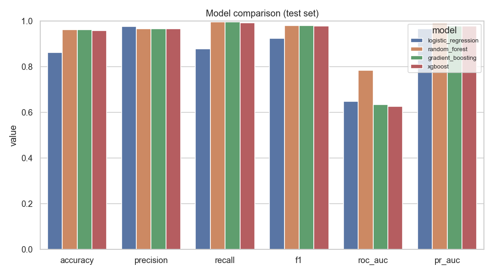
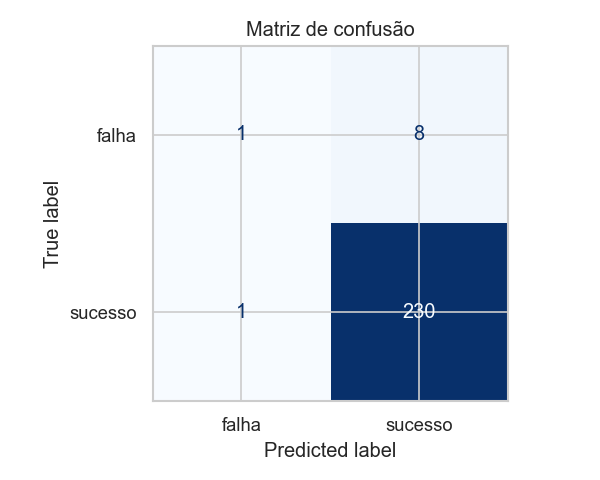
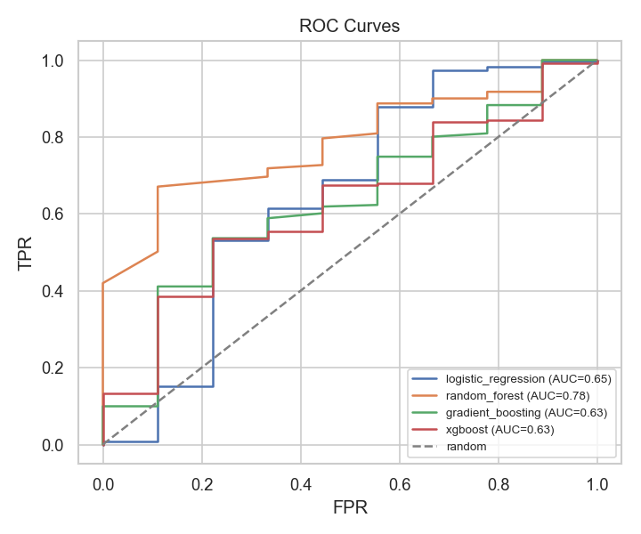
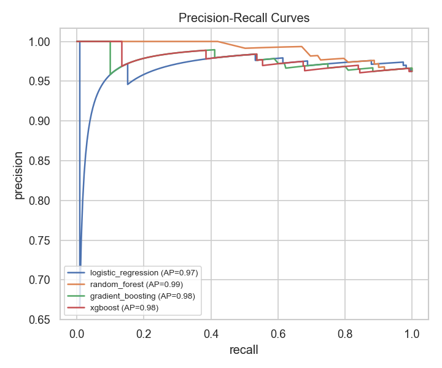
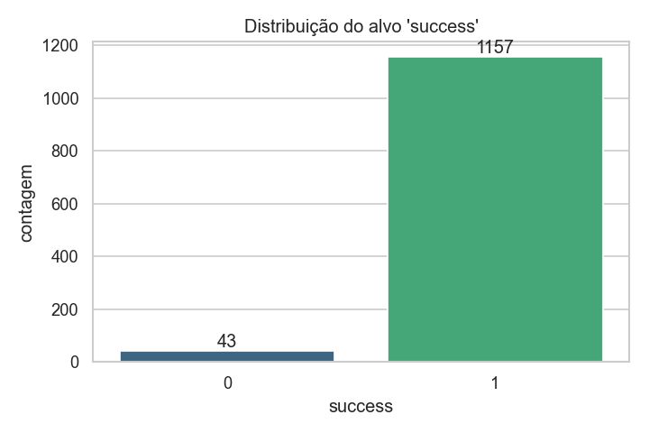
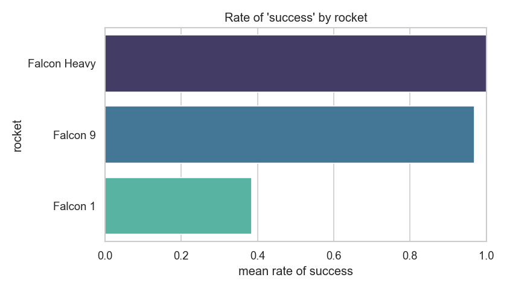
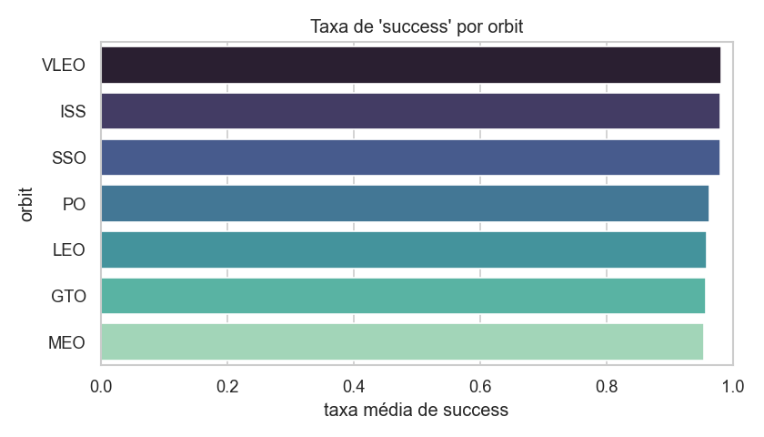
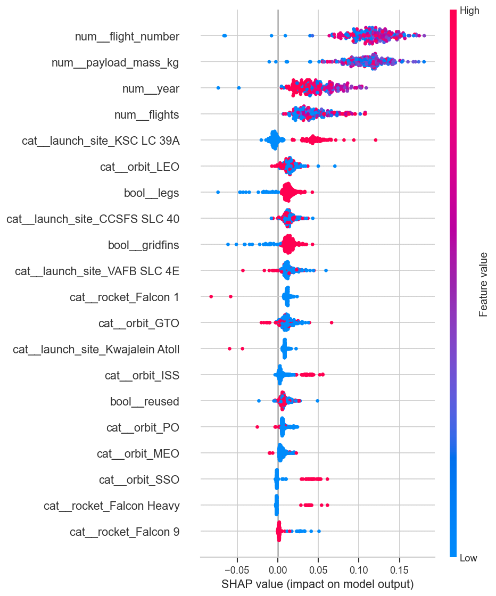
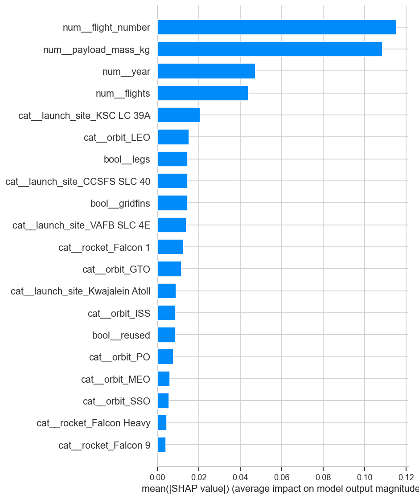
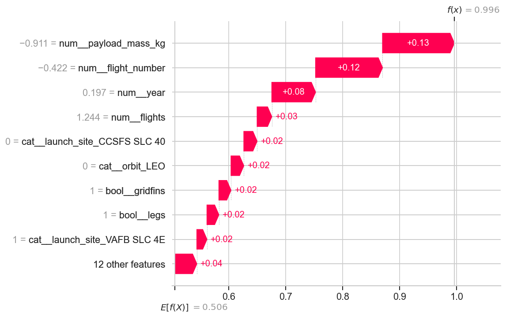

# 🚀 SpaceX Launch Success — Pipeline de ML

> **FIAP — Global Solution 2026 · Indústria Espacial · disciplina GAIE**

Pipeline completo, modular e reprodutível de *Machine Learning* que **classifica
o sucesso de lançamentos da SpaceX** a partir de massa do payload, tipo de
órbita, versão do foguete e reúso do booster (entre outras features). Inclui
ingestão da API pública, pré-processamento sem *data leakage*, comparação de
modelos com tratamento explícito de desbalanceamento, interpretabilidade com
SHAP, testes (96% de cobertura) e um app de inferência em Streamlit.

---

## 📑 Índice

1. [Contexto do problema](#1-contexto-do-problema)
2. [Fonte dos dados](#2-fonte-dos-dados)
3. [Metodologia](#3-metodologia)
4. [Modelos testados](#4-modelos-testados)
5. [Resultados](#5-resultados-tabela-de-métricas)
6. [Interpretabilidade com SHAP](#6-interpretabilidade-com-shap)
7. [Como executar (passo a passo)](#7-como-executar-passo-a-passo)
8. [Deploy e link da aplicação](#8-deploy-e-link-da-aplicação)
9. [Arquitetura do projeto](#9-arquitetura-do-projeto)
10. [Qualidade de engenharia](#10-qualidade-de-engenharia)
11. [Integrantes](#11-integrantes)

---

## 1. Contexto do problema

A economia espacial depende da **confiabilidade e da reutilização** de foguetes.
A SpaceX revolucionou o setor reduzindo custos com boosters recuperáveis. Prever
o **sucesso de um lançamento** ajuda a antecipar risco operacional, precificar
seguros e planejar manifestos de missão.

* **Tarefa:** classificação **binária supervisionada** — `sucesso = 1` / `falha = 0`.
* **Alvo principal:** `success` (sucesso do lançamento).
* **Alvo alternativo (configurável):** `landing_success` (recuperação do 1º
  estágio) — mais balanceado e com análise mais rica. Basta
  `export LAUNCH_TARGET=landing_success`.

### ⚠️ Desafio crítico: desbalanceamento de classes

A SpaceX tem taxa de sucesso de lançamento **> 95%**. Um modelo ingênuo que
"chuta sempre sucesso" atinge ~95% de **acurácia** e é **inútil** (não detecta
falhas). Por isso, o projeto trata o desbalanceamento de forma explícita
(ver [§3](#3-metodologia)) e **não** decide pela acurácia.

## 2. Fonte dos dados

* **Canônica (real):** [API v4 da SpaceX](https://api.spacexdata.com/v4) —
  endpoints `/launches`, `/rockets`, `/payloads`, `/launchpads`, resolvidos em
  **uma linha por lançamento** (`make ingest`).
* **Fallback reprodutível (sintético):** dataset versionado em
  [`data/processed/spacex_launches.csv`](data/processed/spacex_launches.csv)
  (**1.200 linhas, 14 colunas**), calibrado em estatísticas reais da SpaceX,
  para o projeto rodar *out-of-the-box* caso a API esteja indisponível.

> Detalhes de schema, endpoints e proveniência em
> [`data/README.md`](data/README.md). **Os resultados abaixo usam o dataset de
> fallback**; o caminho real (API) produz o mesmo schema.

## 3. Metodologia

| Etapa | O que é feito |
|-------|----------------|
| **Ingestão** | API v4 → resolução de `id`s → CSV; *timeout*, *retry* e tratamento de erro. Fallback sintético se offline. |
| **Limpeza** | remove `upcoming`; descarta alvo nulo; coage tipos (booleanos → `{0,1,NaN}`). |
| **EDA** | distribuição do alvo, taxa de sucesso por órbita/foguete/reúso (gráficos salvos). |
| **Engenharia** | deriva `year`; monta `ColumnTransformer`. |
| **Pré-processamento** | numéricas: imputação por mediana + `StandardScaler`; categóricas: imputação + `OneHotEncoder(handle_unknown="ignore")`; booleanas: imputação pela moda. |
| **Treino** | ≥ 3 modelos dentro de `Pipeline`, com `StratifiedKFold`. |
| **Tuning** | busca de hiperparâmetros (`RandomizedSearchCV`/`GridSearchCV`) com CV estratificada, **só no treino** (`LAUNCH_TUNE_HYPERPARAMETERS=true`). |
| **Seleção** | melhor modelo pela **F1 de validação cruzada** (configurável p/ PR-AUC). |
| **Persistência** | `joblib` (pipeline + metadados). |
| **Interpretação** | SHAP (summary, bar, waterfall). |
| **Deploy** | app Streamlit de inferência + explicação SHAP da previsão. |

### Tratamento do desbalanceamento (obrigatório)

* **Split estratificado** (`stratify=y`) e **validação cruzada estratificada**
  (`StratifiedKFold`);
* **`class_weight="balanced"`** na Regressão Logística e na Random Forest;
* **SMOTE opcional** (`imbalanced-learn`) aplicado **apenas no fold de treino**,
  dentro do pipeline (`LAUNCH_USE_SMOTE=true`);
* avaliação por **F1, recall, precision, ROC-AUC e PR-AUC** + matriz de confusão —
  **nunca só acurácia**;
* seleção do melhor modelo por **F1/PR-AUC**.

### Otimização de hiperparâmetros

Cada modelo pode passar por uma busca cruzada de hiperparâmetros
([`trainer.tune_pipeline`](src/launch_success/models/trainer.py),
espaços em [`registry.get_param_distributions`](src/launch_success/models/registry.py)):
`RandomizedSearchCV` (padrão) ou `GridSearchCV`, sempre com `StratifiedKFold`
e o pré-processador **dentro** do pipeline (sem leakage). Os melhores
hiperparâmetros de cada modelo são salvos em `models/metrics.json` e
`models/best_model.meta.json`. Ative com:

```bash
LAUNCH_TUNE_HYPERPARAMETERS=true make train
```

> Mantido **desligado por padrão** para deixar a suíte de testes/CI rápida; os
> artefatos versionados neste repositório foram gerados **com tuning ligado**.

### Sem *data leakage*

Todo o pré-processamento (imputação, escala, one-hot) vive **dentro** de um
`Pipeline`/`ColumnTransformer`, ajustado (`fit`) **só no treino**. Nenhum `fit`
no dataset inteiro. Reprodutibilidade garantida por `random_state` fixo e
dependências pinadas em [`requirements.txt`](requirements.txt).

## 4. Modelos testados

Quatro estimadores candidatos ([`models/registry.py`](src/launch_success/models/registry.py)):

1. **Regressão Logística** (`class_weight="balanced"`) — baseline linear interpretável.
2. **Random Forest** (`class_weight="balanced"`) — ensemble robusto a não-linearidades.
3. **Gradient Boosting** — boosting sequencial.
4. **XGBoost** *(opcional)* — incluído automaticamente quando a biblioteca está
   disponível (depende do runtime OpenMP). O projeto funciona sem ele.

Cada um possui um espaço de busca de hiperparâmetros próprio (ver §3 — Otimização
de hiperparâmetros).

## 5. Resultados (tabela de métricas)

Conjunto de teste (20%, estratificado), alvo `success`, seleção por **F1 de CV**,
**com otimização de hiperparâmetros** (`RandomizedSearchCV`):

| modelo | CV F1 (±dp) | accuracy | precision | recall | **F1** | ROC-AUC | PR-AUC |
|--------|:-----------:|:--------:|:---------:|:------:|:------:|:-------:|:------:|
| **random_forest** 🏆 | **0.985 ± 0.005** | 0.962 | 0.966 | 0.996 | **0.981** | 0.785 | 0.990 |
| xgboost | 0.984 ± 0.003 | 0.958 | 0.966 | 0.991 | 0.979 | 0.627 | 0.978 |
| gradient_boosting | 0.984 ± 0.003 | 0.962 | 0.966 | 0.996 | 0.981 | 0.634 | 0.977 |
| logistic_regression | 0.884 ± 0.016 | 0.862 | 0.976 | 0.879 | 0.925 | 0.647 | 0.967 |

**Modelo vencedor: Random Forest** (maior F1 de CV). Hiperparâmetros vencedores
salvos em [`models/metrics.json`](models/metrics.json) — ex.: RF com
`n_estimators=500, max_depth=20`.

> 💡 **Impacto do tuning:** a Regressão Logística saltou de **F1 0.854 → 0.925**
> (CV 0.826 → 0.884) após a busca de `C`, a maior melhora relativa — exatamente o
> que se espera otimizar no baseline. Os modelos de árvore, já fortes, ganharam
> sobretudo em **ROC-AUC/PR-AUC** (RF: 0.771 → 0.785 / 0.988 → 0.990).
>
> 💡 **Leitura crítica do desbalanceamento:** mesmo otimizada, a Regressão
> Logística com `class_weight="balanced"` tem **accuracy mais baixa (0.86)** e
> **precision alta (0.98)** — ela "paga" acurácia para capturar as falhas raras,
> evidenciando por que a acurácia isolada engana sob desbalanceamento.

Gráficos gerados em [`reports/figures/`](reports/figures/):

| Comparação de modelos | Matriz de confusão | Curvas ROC | Curvas PR |
|:---:|:---:|:---:|:---:|
|  |  |  |  |

EDA — distribuição do alvo e taxas por categoria:

| Distribuição do alvo | Taxa por foguete | Taxa por órbita |
|:---:|:---:|:---:|
|  |  |  |

## 6. Interpretabilidade com SHAP

[`interpretability/shap_analysis.py`](src/launch_success/interpretability/shap_analysis.py)
usa **`TreeExplainer`** para modelos de árvore e **`LinearExplainer`** para a
Regressão Logística (com **`KernelExplainer`** como fallback genérico), operando
no espaço pós-`ColumnTransformer`.

**Variáveis mais influentes (|SHAP| médio, modelo vencedor):**

| # | feature | leitura |
|---|---------|---------|
| 1 | `flight_number` | proxy da **maturação** da SpaceX — voos mais recentes são mais confiáveis |
| 2 | `payload_mass_kg` | cargas mais pesadas elevam o risco/energia da missão |
| 3 | `year` | reforça a curva de aprendizado ao longo do tempo |
| 4 | `flights` | mais voos do core ↔ booster provado |
| 5 | `launch_site`, `orbit` (GTO/LEO) | local e energia da órbita afetam o desfecho |
| 6 | `rocket = Falcon 1` | empurra fortemente para **falha** (baixa confiabilidade inicial) |
| 7 | `gridfins`, `legs` | hardware de recuperação, relevante sobretudo para `landing_success` |

| SHAP summary (beeswarm) | SHAP importância global (bar) | SHAP de uma previsão (waterfall) |
|:---:|:---:|:---:|
|  |  |  |

## 7. Como executar (passo a passo)

Pré-requisito: **Python 3.11+**. Tudo roda do zero com os comandos abaixo.

```bash
# 1) Clonar e entrar no projeto
git clone <URL-DO-REPO> && cd spacex-launch-success

# 2) Criar o ambiente e instalar as dependências (pinadas)
make venv          # cria .venv com Python 3.11
make install       # instala requirements.txt + o pacote (editable)

# 3) (Opcional) Ingestão real da API v4 — gera data/processed/spacex_launches.csv
make ingest        # se offline, cai automaticamente no dataset sintético

# 4) Treinar: compara modelos, escolhe o melhor, salva e gera SHAP/figuras
make train

# 5) Subir o app de inferência (Streamlit)
make app

# Qualidade
make lint          # ruff + black --check (sem warnings)
make test          # pytest com cobertura (>= 80%)
```

> Sem `make`? Os comandos equivalentes:
> `python -m venv .venv && .venv/bin/pip install -r requirements.txt -e .`,
> `python scripts/run_training.py`, `streamlit run app/streamlit_app.py`,
> `pytest -q --cov=src/launch_success`.

### Configuração (opcional)

Sobrescreva qualquer parâmetro via variáveis de ambiente com prefixo `LAUNCH_`
(ver [`.env.example`](.env.example)). Ex.: treinar para o alvo de pouso e
selecionar por PR-AUC:

```bash
LAUNCH_TARGET=landing_success LAUNCH_SELECTION_METRIC=pr_auc make train
LAUNCH_TUNE_HYPERPARAMETERS=true make train   # treino com busca de hiperparâmetros
```

## 8. Deploy e link da aplicação

O app [`app/streamlit_app.py`](app/streamlit_app.py) recebe massa do payload,
órbita, versão do foguete, booster reutilizado (+ extras), carrega o pipeline
persistido e mostra **probabilidade de sucesso + explicação SHAP** da previsão.

**🔗 Link público da aplicação:** `⟨PREENCHER — ex.: https://spacex-launch-success.streamlit.app⟩`

### Publicar grátis (Streamlit Community Cloud)

1. Suba este repositório para o GitHub (o modelo treinado em `models/` já está
   versionado, então o app funciona sem retreinar).
2. Acesse <https://share.streamlit.io>, conecte o repositório e aponte para
   `app/streamlit_app.py` (Python 3.11, `requirements.txt`).
3. *Deploy* → copie a URL pública e cole acima.

> Alternativas aceitas: **Hugging Face Spaces**, **Gradio**, **FastAPI/Flask**,
> ou **Ngrok** para um túnel temporário (`streamlit run app/streamlit_app.py` +
> `ngrok http 8501`).

## 9. Arquitetura do projeto

```
spacex-launch-success/
├── src/launch_success/
│   ├── config.py                # Settings (pydantic-settings): paths, seed, alvo, hiperparâmetros
│   ├── exceptions.py            # exceções customizadas
│   ├── data/
│   │   ├── spacex_client.py     # cliente da API v4 (timeout/retry)
│   │   ├── ingestion.py         # busca + join dos endpoints → DataFrame → CSV
│   │   ├── synthetic.py         # gerador de fallback (≥1.000 linhas, calibrado)
│   │   ├── schemas.py           # modelos de domínio (Payload, Core)
│   │   └── loader.py            # load_dataset() do CSV
│   ├── features/
│   │   ├── cleaning.py          # filtragem, coerção de tipos, nulos
│   │   └── engineering.py       # year/derivações + ColumnTransformer
│   ├── models/
│   │   ├── registry.py          # estimadores candidatos
│   │   ├── trainer.py           # split/CV/treino → pipeline + métricas
│   │   └── persistence.py       # save/load com joblib
│   ├── evaluation/
│   │   ├── metrics.py           # acc/prec/recall/f1/roc_auc/pr_auc
│   │   └── plots.py             # confusão, ROC/PR, comparação, EDA
│   ├── interpretability/
│   │   └── shap_analysis.py     # explainers + summary/bar/waterfall
│   └── pipeline.py              # orquestração ponta a ponta
├── app/streamlit_app.py         # UI de inferência + SHAP
├── tests/                       # pytest (espelha src/), cobertura 96%
├── scripts/                     # run_ingestion / generate_dataset / run_training
├── data/{raw,processed}/ + data/README.md
├── models/                      # melhor pipeline + metadados (versionados)
├── reports/figures/             # gráficos gerados (versionados)
├── pyproject.toml · requirements.txt · Makefile · .gitignore
└── README.md
```

## 10. Qualidade de engenharia

* **Arquitetura modular** com separação de responsabilidades e config central.
* **Clean code:** type hints completos, docstrings estilo Google, `pathlib`,
  `logging` (sem `print` em biblioteca), exceções customizadas, funções puras.
* **Lint sem warnings:** `ruff` + `black` (linha 100).
* **Testes:** `pytest` espelhando `src/`, **97% de cobertura** (mín. 80%),
  determinísticos (seeds) e **sem rede real** (HTTP mockado com `responses`).
* **Reprodutível:** `random_state` fixo, dependências pinadas, roda do zero.

```bash
make test   # 222 testes · cobertura 97%
make lint   # ruff: all checks passed · black: all done
```

## 11. Integrantes

| Nome | RM |
|------|----|
| Gustavo Vegi | RM550188 |
| Pedro Henrique Silva de Morais | RM98804 |
| Lucas Rodrigues Delfino | RM550196 |
| Luisa Cristina dos Santos Neves | RM551889 |
| Gabriel Aparecido Cassalho Xavier | RM99794 |

---

<sub>Projeto acadêmico — FIAP Global Solution 2026 (GAIE). Dados: SpaceX API v4
(público) e dataset sintético calibrado para reprodutibilidade offline.</sub>
